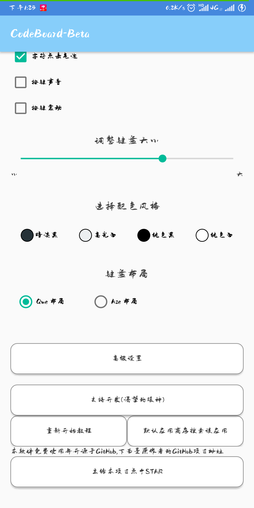
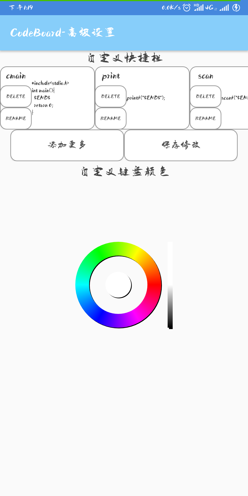
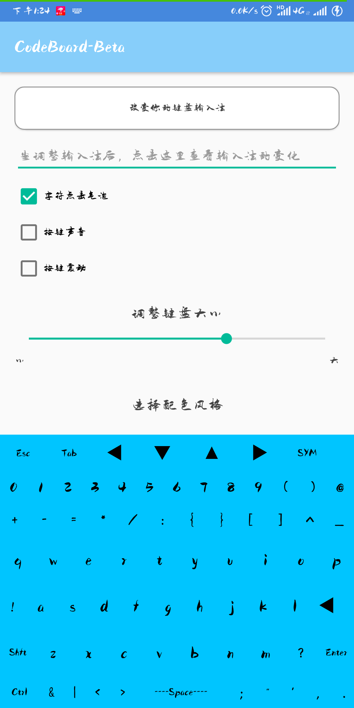
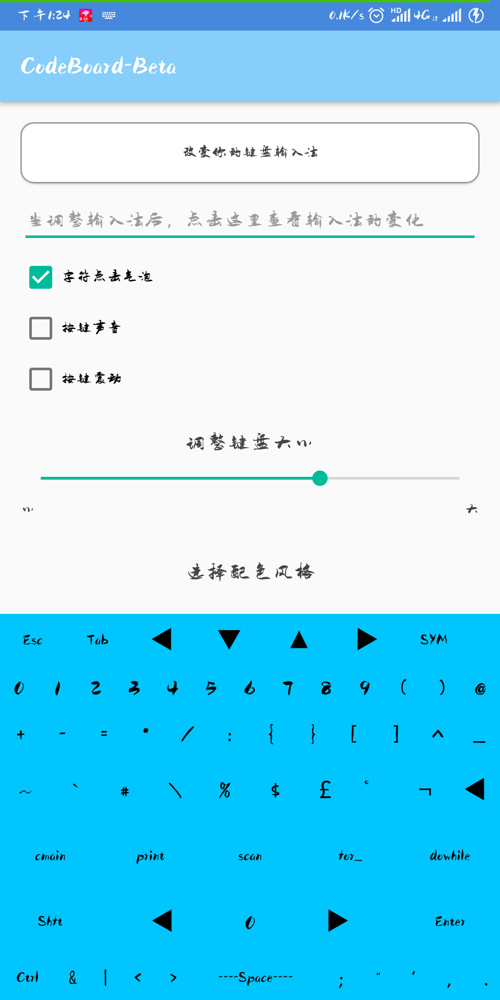

# [CodeBoard](https://play.google.com/store/apps/details?id=com.gazlaws.codeboard)

## 让你更轻松的在移动设备上编写代码. 不用再因为各种类型键盘切换而烦恼.比起其他键盘拥有更高的自由度.

### 特点:

- 支持Tap键与ESC键
- 支持自定义快捷键
- 支持剪切赋值粘贴全选上一步下一步等快捷键
- 最大程度保留你在电脑上的编码习惯
- 有多种配色风格，并支持自定义键盘颜色
- 没有广告与内购，专门为学生制作
* * * * *
# 界面图片

> ## 普通设置界面
>
>## 高级设置界面
>
>## 普通键盘界面与SYM键盘界面
>
>

# [CodeBoard](https://play.google.com/store/apps/details?id=com.gazlaws.codeboard)

## Coding on your mobile device just got easier. No more switching between numbers, symbols and alphabets.More freedom than other keyboards.

### Features:

- Support Tap and ESC key
- Support custom shortcut key
- Support Cut, Copy, Paste, Select All, Undo, Redo
- Restore computer button habits to the maximum extent
- Have a variety of color schemes, and support custom keyboard colors
- No ADS && IAP, made for student
* * * * *
# Interface Image

> ## Normal Setting
>
>## Greater Setting
>
>## KeyBoard Interface
>
>
